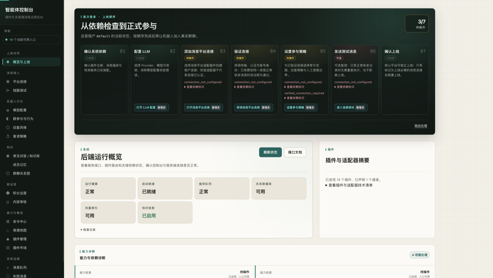
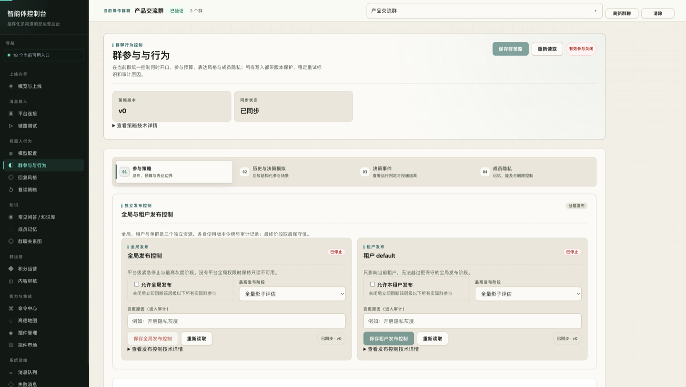
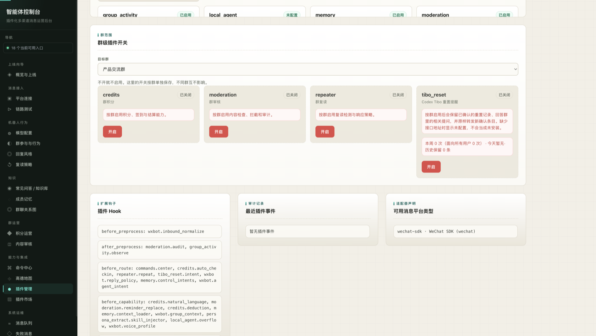
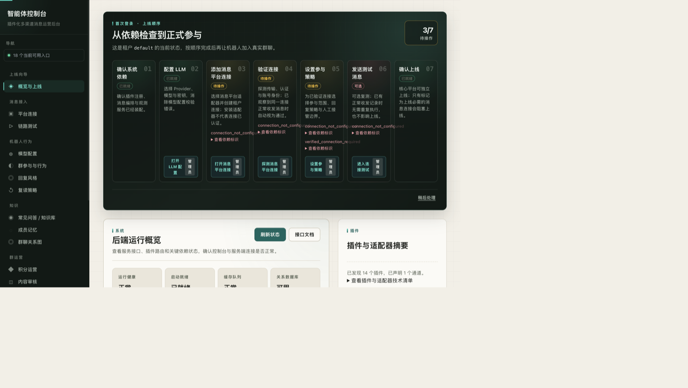

# 控制台样式评估（2026-09-13）

- 评估对象：`origin/main` @ `ed686d9`（前端样式与 `feat/semantic-intent-local-agent` 仅差 5 个文件 / -108 行，结论对两者都成立）
- 方法：本地起完整栈（嵌入式 PostgreSQL 16 + Redis、API、三个 worker、Vite dev server）并用一个假的 wxbot SDK 名册让群级页面有数据；登录后在 1920×1080、1280×800、390×844 三种视口逐页截图；统计 CSS token / 选择器 / 渲染字号分布；按 WCAG 2.1 计算主要配色对比度
- 用途：作为 `refactor/console-ui-style` 分支的工作清单；截图见 `docs/assets/ui-review/`

## 总体判断：3.0 / 5

视觉语言是成立的。Ink & Pine（暗墨侧栏 + 暖纸底 + 松绿点缀）辨识度高，登录页和 404 页有编辑感，9 组主要文字配色对比度全部 AA 达标，移动端 390px 的单列折叠、焦点环、跳转链接、role / aria 标注、`prefers-reduced-motion` 都做了。

问题出在进入功能页之后：每页套同一模板——眉标 + 大标题 + 一排统计瓦片 + 卡片套卡片 + 底部“技术详情”——67% 的文字元素 ≤ 13px，表单 label / 表头 / 瓦片标签 / 眉标全部是 11px 大写等宽字。结果是“密而不清”，像给开发者看的调试台，不像给运营用的控制台。

## 逐页评分

评分依据：第一印象、层级清晰度、留白 / 密度平衡、缺陷数量。4 = 可直接对外，3 = 可用但需打磨，≤ 2.5 = 需要重排。

| 页面 | 路由 | 评分 | 观察 | 建议 |
| --- | --- | :-: | --- | --- |
| 登录 | `/login` | 4.0 | 暗墨 / 暖纸分栏，超大标题有编辑感，全站视觉最完整；底部“传输 / 鉴权 / 端点”元信息 11px 等宽字太小 | 保留；元信息升到 12–13px，去掉等宽 |
| 404 | `*` | 4.0 | 斜切分栏 + 描边大号 404，与登录页同一语言 | 保留 |
| 消息队列 | `/queues` | 3.5 | 运维页里最完整：过滤条 → 流选择卡 → 列表 / 详情分栏，自动刷新状态行清楚 | 空态区域过高，给列表加骨架行 |
| 常见问答 / 知识库 | `/knowledge` | 3.5 | 左列表右编辑器的双栏合理；用了第三种 tab 样式（胶囊）；列表列太窄 | 统一 tab；列表 / 编辑器改 2:3 |
| 概览与上线 | `/` | 3.0 | 暗色上线向导卡是全站最强视觉锚点；7 列网格在 1121–1500px 破版；红色原始错误码直出；右侧“插件与适配器摘要”几乎空白 | 网格改 auto-fit；错误码映射文案；摘要卡填充或合并 |
| 平台连接 | `/channels` | 3.0 | 结构清楚；5 个全为 0 的瓦片 + 两个空态占满首屏；四步图例 11px | 无数据时隐藏瓦片，把适配器卡做首屏主体 |
| 模型配置 | `/llm` | 3.0 | 表单规整；6 个瓦片 4+2 断行留空；“部署与密钥状态”定义列表缩进错位 | 瓦片一行 6 或 3+3；定义列表两列对齐 |
| 群参与与行为 | `/group-behavior` | 3.0 | 内容最多也最重：编号 tab 卡 → 卡 → 双卡 → 每卡 4 控件 + 技术详情，四层嵌套；同屏三个“重新读取”；label 11px 等宽 | 嵌套压到两层；操作收敛到卡头；label 改常规字体 |
| 回复风格 | `/persona` | 3.0 | 左矮右高的网格留下大空洞；头部 6 个动作按钮平铺；成员表首列按钮样式像表头 | 左列固定名册 + 结果，右列任务；按钮分主次 |
| 成员记忆 | `/memory` | 3.0 | 6 tab 工作区 + 大段说明文字；placeholder 里塞的是警告语；3 列表格撑满全宽 | 说明收进提示；表格限宽 |
| 群聊关系图 | `/relationship-graph` | 3.0 | 图区 + 图例 + 双列表的上半部分好；下半部分 6 个折叠盒 + 2 个技术详情叠成手风琴长页 | 折叠盒合并为侧边抽屉 |
| 内容审核 | `/moderation` | 3.0 | 双卡布局清楚；“加载状态：正在读取 · 草稿：已同步 / 配置版本：-”技术状态行暴露 | 状态行改卡头一个 Pill |
| 命令中心 | `/commands` | 3.0 | 全局页没有顶部群条，内容贴顶，与群级页顶部留白不一致；命令清单靠 textarea 逐行维护 | 全局页补统一页头高度；清单改标签输入 |
| 高德地图 | `/amap` | 3.0 | 简洁；“缺失 / 需检查”作为瓦片值可读 | 无大问题 |
| 微信机器人桥接 | `/wxbot` | 3.0 | 瓦片值中英混排：已停止 / 离线 / stopped / stopped；带计数的 tab 又是一种样式 | 状态值统一映射中文；统一 tab |
| 积分运营 | `/credits` | 2.5 | 单列超长表单，数字输入拉到 700px 宽；积分规则用 textarea 写 `low=5` 配置；没有分组 | 分 基础 / 签到 / 计费 三组；数字输入限宽 160px |
| 插件管理 | `/plugins` | 2.5 | 每个键值对一行一个框；14 张卡各带红色“全局停用”；群级开关说明文字放在红色危险框里；“Flow / Effect 运行视图”是只有标题的空卡；Hook 原始标识与英文描述直出 | 见缺陷表 |
| 插件市场 | `/plugins/marketplace` | 2.5 | 与插件管理重复的卡片结构；全部已安装，页面唯一动作是一排红色“卸载插件” | 已安装项弱化动作；与插件管理合成一页两 tab |
| 失败消息 | `/dlq` | 2.5 | 4 个字段 + 两个禁用红按钮，结果区不预留，85% 空白 | 并入消息队列（队列页已有“失败消息”流） |
| 复读策略 | `/repeater` | 2.0 | 一个开关一个数字撑一页；状态 Pill 直接显示英文 `loading` | 并入群参与与行为的一个分区 |
| 链路测试 | `/playground` | 2.0 | 顶部群条 + 一张空卡，80% 留白；红色原始错误 `502 wxbot sdk unavailable` | 空态给示例消息与一键发送；错误文案化 |

## 贯穿全站的四个问题

### 1. 字太小，且到处是等宽字

- 插件管理页 672 个带文字的元素：11px 43 个、12px 267 个、13px 143 个、14px 158 个、15px 10 个、16px 42 个、≥ 18px 9 个；14px 及以上只占 31%
- `--font-mono` 有 28 处声明（`frontend/src/styles.css`），覆盖 `th`（`:1960`）、表单 label `.field span`（`:826`）、瓦片标签 `.status-tile span`（`:1122`）、眉标 `.section-kicker`（`:108`，11px + uppercase）、摘要卡 `.summary-card span`（`:1643`）
- 等宽字栈 `Cascadia Code, JetBrains Mono, Consolas, SFMono-Regular, Menlo, PingFang SC…`：中英混排时数字 / 字母落在 Menlo、汉字落回 PingFang，同一行两种字形
- `tokens.css` 定义了 `--font-size-3xs`（10px）和 `--font-size-2xs`（11px）两档；`styles.css` 内 `var(--font-size-xs)` 68 次、`sm` 61 次、`base` 23 次

### 2. 统一模板让“每页都一样、每页都空”

- `<StatusTile>` 在页面中出现 37 处，绝大多数无数据时显示 0，却占据首屏最显眼的一行（平台连接 5 个 0、命令中心 4 个 0、成员记忆 4 个 0）
- 链路测试 / 复读策略 / 失败消息三页有效内容不到一屏的 20%；群参与 / 积分两页一屏又塞不下一个表单。留白和密度没有按信息量分配

### 3. 容器嵌套过深、操作过多

- 群参与与行为页四层容器：编号 tab 卡 → 分区卡 → 双子卡 → 每卡 4 个控件 + 折叠“技术详情”；同屏三个“重新读取”、两个“保存”、两个“查看技术详情”
- 插件卡把每个键值对单独描边成一行；14 张卡各挂一个红色“全局停用”
- `<TechnicalDetails>` 折叠在页面中出现 35 处

### 4. 开发者视角的文案泄漏

- 原始错误码：`connection_not_configured`、`verified_connection_required`（概览）、`502 wxbot sdk unavailable`（群级页顶部群条）
- Hook 标识：`before_route: commands.center, credits.auto_checkin, …`（插件管理）
- 14 条英文插件描述来自 `plugins/*/plugin.py` 的 `description=` 字段
- 状态值 `stopped`（微信桥接瓦片）、`loading`（复读策略 Pill）
- “加载状态：正在读取 · 草稿：已同步 · 配置版本：-”（内容审核 / 命令中心）

## 可直接修的缺陷

| # | 位置 | 现象 | 证据 / 修法 |
| :-: | --- | --- | --- |
| 1 | 概览 · 上线向导 | 7 列网格在 1121–1500px 破版 | `frontend/src/styles/pages/capabilities.css:171-179` `.launch-step-list { grid-template-columns: repeat(7, minmax(0, 1fr)) }`，到 `:518` `@media (max-width: 1120px)` 才降 4 列。1280×800 实测每卡约 90px，错误码溢出到相邻卡片，按钮折成 3 行，“管理员”Pill 竖排。改 `repeat(auto-fit, minmax(150px, 1fr))` |
| 2 | 全站 · 侧栏 | 1080px 高度下导航溢出，“管理会话”被推到折叠区 | 18 个入口 + 7 组标题不折叠；点击“管理会话”需先滚动侧栏 2 次。导航区独立 `overflow-y: auto`，会话菜单固定底部 |
| 3 | 全站 · 路由切换 | 切页不回顶部 | `frontend/src/App.tsx:360` 已有 `useLocation`，但没有对 `pathname` 变化做 `scrollTo(0, 0)`；从成员记忆滚到底再点群聊关系图，新页停在旧滚动位置 |
| 4 | 全站 · 群选择 | 刷新页面丢失当前群 | `frontend/src/state/console-config.tsx` 只在内存保存 `sessionId`（第 15、40、126 行），任何 F5 后所有群级页回到“先选择一个已验证群聊”。改存 `sessionStorage`，名册加载后校验 id 仍在列表内再恢复 |
| 5 | 插件管理 · 群级插件开关 | 中性说明文字放在红色危险框里 | `frontend/src/styles/pages/plugins.css:301-307` 把 `.plugins-page .plugin-card .muted-copy` 定义成 `border: red-200; background: #fff7f7; color: red-700`；`GroupPluginScopeSection.tsx:92` 的描述用的正是 `.muted-copy`。删除该覆盖或改用 `--tone-muted-*` |
| 6 | 插件管理 | 只有标题的空卡 | `frontend/src/pages/plugins/FlowRuntimeSection.tsx:664` 在 flow runtime 关闭时仍渲染“Flow / Effect 运行视图”外壳。无内容时不渲染，或给出“未启用”说明 |
| 7 | 概览 / 链路测试 / 群参与 | 原始错误码直出 | 建一份 `code → 文案` 映射（`connection_not_configured` → “尚未配置消息平台连接”等），前端统一走映射，未知码才回退原文 |
| 8 | 复读策略 / 微信桥接 | 未翻译的状态值 | 状态 Pill 显示 `loading`；瓦片值 `stopped` 与同排“已停止 / 离线”混排。状态值统一映射 |
| 9 | 插件管理 / 插件市场 | 14 个插件描述全是英文 | `plugins/amap/plugin.py:15`、`plugins/commands/plugin.py:21`、`plugins/credits/plugin.py:42` 等 `description=`。descriptor 增加 `description_zh` 或直接改中文 |
| 10 | 概览 · 能力诊断 | “群参与与行为”卡挂的是微信按钮 | `app/admin/capabilities.py:270-279` 用 `**wxbot_capability` 展开后只覆盖 id / label / route，`actions` 继承自 wxbot，于是显示“管理微信 SDK 连接 / 打开微信高级设置”。为该能力单独给 actions |
| 11 | 模型配置 · 部署与密钥状态 | 定义列表缩进错位 | 标签与值交错缩进，读起来像两级列表。改两列 `dl` 网格 |

## 样式系统健康度

| 指标 | 数值 | 说明 |
| --- | ---: | --- |
| CSS 总行数 | 12,502 | 16 个文件；`styles.css` 单文件 5,404 行、`styles/pages/plugins.css` 2,552 行 |
| 调色板变量（`styles/palette.css`） | 162 | 63 个 `--color-custom-xxxxxx` 只被引用 5 次；slate / indigo / purple / gray 系 22 个变量 0 引用，是旧蓝灰主题迁到 Ink & Pine 的残留 |
| tab 视觉样式 | 7 种 | `.tabs`、`.tab-bar`、`.knowledge-tab`、`.group-behavior-tab-*`、`.memory-workspace-tabs`、`.memory-graph-tabs`、`.relationship-view-tab`；共享 `components/Tabs.tsx` 只有 4 个文件用且各自再覆盖样式 |
| 圆角取值 | 22 种 | token 只定义 4 档（4 / 6 / 10 / 999px） |
| 共享 `DataTable` | 1 处 | 20 个页面里有 41 处手写 `<table>` |
| `StatusTile` | 37 处 | 见问题 2 |
| `TechnicalDetails` | 35 处 | 见问题 3 |
| 等宽字体声明 | 28 处 | 见问题 1 |
| `!important` | 8 处 | |
| `linear-gradient` | 有 | `plugins.css:322`、`:326` 等，与其它页面的平面风格不一致 |
| Toast / 通知组件 | 无 | 38 处 `<Alert>` 内联占位 |
| 骨架屏 / 加载组件 | 无 | 188 处“读取中… / 刷新中… / loading”文案 |
| 暗色模式 | 无 | 侧栏与登录页已是暗色，`tokens.css` 的语义 token 已就绪 |
| 语义 token vs 原始色 | 430 : 99 | `styles.css` 中 `var(--bg|--panel|--text|--tone-*)` 430 次、`var(--color-*)` 99 次，纪律尚可 |

### 配色对比度（WCAG 2.1）

| 前景 / 背景 | 对比度 | 结论 |
| --- | ---: | --- |
| 正文 `ink-900` / `paper-bright` | 15.75 | 通过 |
| 次要 `ink-600` / `paper-bright` | 6.50 | 通过 |
| 瓦片标签 `ink-500` / `paper-dim` | 5.10 | 通过 |
| 眉标 `pine-700` / `paper-bright` | 6.61 | 通过 |
| `pine-600` / `paper-bright` | 3.58 | 仅大字通过，避免用于 11–12px |
| 侧栏文字 `sage-300` / `ink-sidebar` | 8.25 | 通过 |
| 侧栏选中 `pine-300` / `ink-sidebar` | 12.11 | 通过 |
| 警告 `amber-700` / `paper-bright` | 4.81 | 通过 |
| 危险 `red-700` / `paper-bright` | 6.19 | 通过 |
| 卡片边线 `paper-line` / `paper-bright` | 1.37 | 装饰性边线，可接受 |

## 建议的优化顺序

1. **先修 11 个缺陷（1–2 天）**：上线向导网格 `auto-fit`；侧栏导航独立滚动并把“管理会话”固定底部；路由切换 `scrollTo(0, 0)`；已验证群 id 存 `sessionStorage` 并在名册加载后校验；`.plugin-card .muted-copy` 改中性 tone；Flow / Effect 无内容不渲染外壳；错误码与状态值中文映射；插件描述补中文；`social.group_behavior` 单独 actions。
2. **排版基线（半天，改 token 即生效）**：正文 14px、辅助 13px、最小 12px，删除 `3xs` / `2xs` 两档；`label`、`th`、瓦片标签、眉标改回 `--font-body` 并取消 `uppercase`；等宽只保留 ID、路径、代码。对观感提升最大。
3. **页面模板减负（按页推进）**：统计瓦片改“有数据才显示”的一行摘要；卡片嵌套 ≤ 2 层；每卡一个主按钮，刷新 / 重读收进卡头图标；35 处“技术详情”统一收进右侧抽屉。先做群参与、插件管理、积分三页。
4. **组件收敛**：一种 Tabs（可选计数 / 编号）；`DataTable` 替换 41 处手写表格；Button 定死 primary / secondary / ghost / danger 四档；补 Toast 与 Skeleton；空态统一 `EmptyState` 并给出下一步动作。
5. **信息架构**：复读策略并入群参与；失败消息并入消息队列；插件管理与插件市场合成一页两 tab。入口 18 → 15，侧栏溢出随之解决。
6. **调色板清理与暗色模式**：删除 `palette.css` 里 85 个无引用 / 极少引用的变量；剩余 raw 色全部走语义 token；用同一组 token 提供暗色模式。

## 保留项

Ink & Pine 配色与对比度；登录 / 404 的编辑式版式；移动端 390px 的单列折叠与顶部栏；焦点环、跳转链接、role / aria 标注；`prefers-reduced-motion`；消息队列页的过滤 → 流选择 → 列表 / 详情结构。

## 截图索引（`docs/assets/ui-review/`）

| 文件 | 内容 |
| --- | --- |
| `overview-1920.png` | 概览页，1920×1080 |
| `overview-1280-broken.png` | 概览页 1280×800，上线向导 7 列破版（右侧与下方空白为截图工具视口伪影） |
| `group-behavior.png` | 群参与与行为，四层嵌套与等宽 label |
| `plugins-group-switches.png` | 插件管理下半部，红框说明与 Hook 原始标识 |
| `credits-form.png` | 积分运营单列超长表单 |
| `queues.png` | 消息队列，全站结构最好的运维页 |
| `not-found.png` | 404 页 |
