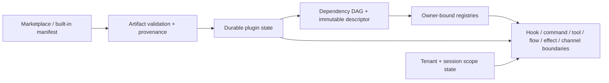

# 插件架构审计与优化（2026-07-18）

## 结论

当前插件系统已从“启动时收集一组 Python 回调”收敛为四层架构：供应链声明、持久控制面、运行时能力目录、逐次执行门禁。此次修复后，`installed/enabled/restart_required/version` 与 tenant/session scope 是执行真相源；禁用、依赖失效和跨副本状态变化会在下一次能力边界生效，而不是只改管理页状态。生产环境的全局 install/upgrade/uninstall/enable/disable 全部关闭，版本和代码代际通过镜像滚动发布；运行时只允许 tenant/session scope 策略变更。

它仍然是**受信任的进程内插件框架**，不是不可信代码沙箱。Python 插件与主进程拥有相同 OS 权限；生产环境因此继续禁止动态 install/upgrade/uninstall，只允许由 digest-pinned 应用镜像交付的内置插件。若未来需要运行第三方不可信代码，必须使用独立进程或容器、最小化 RPC 和 OS 级网络/文件权限，不能把当前 permission 字段当成沙箱。

## 保证模型

可以观察的状态包括：包来源和 checksum、插件版本、依赖图、不可变 descriptor、全局/租户/会话启用状态、lifecycle claim、effect intent 的 producer/handler owner，以及每次消息投递的实际 channel target。

可以控制的动作包括：何时 import、何时 initialize/publish、注册项归属、artifact 原子替换、启停顺序，以及每次执行前是否放行。

本轮要求并验证的最坏情况保证是：

1. 未知或保留 owner 不能继承 kernel 权限。
2. owner 及其所有必需依赖必须同时满足本地 initialized/active、持久 installed/enabled、无 restart fence、版本完全相等；任一依赖禁用即关闭 dependent。
3. tenant/session override 对 owner 的必需依赖同样递归生效。
4. 持久状态查询失败时，控制面和 channel 发送 fail closed；消息流水线中的暂时性查询失败保持 retryable，不能被误 ACK 或永久跳过。
5. effect 必须同时通过 producer owner、handler owner 和 effect-type binding 校验；历史 intent 迁移不能把 handler owner 伪装成 producer owner。
6. 插件禁用先关闭 durable gate，再做进程内 unregister/cleanup；并发请求即使已捕获 callback，也会在最后执行边界重新检查。
7. local archive 在同一份不可变快照上完成 checksum、ZIP 安全校验和解包；数据库提交与目录替换由 lifecycle lease、全局 advisory execution fence、事务式 staging/backup 和失败 settlement 协调。
8. lifecycle 幂等指纹绑定完整目标 manifest generation；同一个 key 不能在版本、URI、checksum、签名、权限、依赖或 capability digest 变化后跨代重放。
9. 无 durable state store 的 API 不初始化或执行插件 owner；只有 `core/channel` kernel owner 可用于离线诊断。

## 已修复问题清单

| 级别 | 原问题 | 修复结果 |
|---|---|---|
| P0 | effect 只有 handler owner，生产者可借其他插件 handler 越权 | intent、commit record、DB、relay 全链路保存 `producer_owner`；dispatcher 先校验 producer，再校验 handler 和绑定；迁移在存在可执行旧 intent 时拒绝升级 |
| P0 | 禁用只影响当前 registry，其他副本或已捕获回调仍可执行 | 所有主路径使用 durable fresh gate；hook、command、agent tool、flow、effect、scheduler、inbound observation、plugin API、channel outbound 均接入 |
| P0 | local archive checksum 后重新打开原文件，存在 TOCTOU | 先复制到唯一快照并边复制边 hash，后续只读取快照；限制 archive、member、总解压大小、压缩比、路径和文件类型 |
| P0 | artifact 目录替换与 DB 状态写入可能分裂 | lifecycle operation 使用 claim token、租约续期和幂等结果；staging/backup activate 后按 durable state commit 或 rollback，状态不明时保留双方供恢复 |
| P1 | 依赖只在初始化时检查，依赖运行时被禁用后 dependent 仍可执行 | 全局、scope 和严格 pipeline gate 都计算必需依赖传递闭包，dependency-first 逐项校验 |
| P1 | disabled 管理页仍调用插件 getter/status，等于绕过禁用 | initialize 时深拷贝 config schema、admin UI、descriptor；disabled 状态只读缓存/持久 metadata，不调用插件代码 |
| P1 | channel provider 被捕获后可绕过 owner scope | `ChannelRegistry` 对非空 owner 返回 gated facade；`get_session_policy/send_text/send_image` 每次按实际 `ChannelTarget` 复验 |
| P1 | command predicate/config/billing 在 owner gate 之前运行 | command owner 在 predicate、配置、计费和 handler 前统一放行；暂时性失败抛 retryable error |
| P1 | scheduler 和 wxbot inbound 直接调用插件方法 | 每次 job/observation 前 fresh gate；明确禁用跳过，暂时性状态故障重试 |
| P1 | 多副本初始化可覆盖并发启停/升级 | `mark_initialized` 使用 enabled + expected version CAS；失败会撤销本地发布；builtin 版本只单调前进 |
| P1 | 外部目录/entrypoint 在审批前已经 import，事后 quarantine 无法撤销顶层代码副作用 | 外部 discovery 只静态读取 package/distribution identity 并排队；durable `installed=true`、来源允许且版本完全一致后才 import；未知、错版本或伪装 builtin 的候选不进入 `sys.modules` |
| P1 | marketplace YAML 容忍重复键、未知字段和 source/package 混配 | duplicate key/item/dependency/permission、未知字段、保留名、类型混配和 builtin URI 漂移均 fail closed |
| P1 | plugin API 的 tenant/session target 未统一经过 scope gate | request dependency 提取 path/query/有界 JSON body 中的全部 target；bulk 请求要求每个 target 都被授权且 body 仍可消费 |
| P1 | scope walker 丢失 query/父节点 tenant，或到 256 节点后静默截断 | walk 显式继承 path→query→父 mapping tenant；子节点可覆盖；session 无 tenant 直接拒绝；超过预算返回 413，禁止部分授权 |
| P1 | 外部包只比对版本/来源，安装目录可被同版本替换 | install 保存 deterministic `tree_digest`；外部 discovery 在 import 前校验 package type、checksum 与整树 digest，symlink/pyc/cache 不进入信任树 |
| P1 | marketplace 只核对四类 legacy capability | manifest 和包内 descriptor 必须携带 canonical SHA-256 capability digest，覆盖 route/hook/tool/command/flow/effect/storage/network/channel/engine/media 全部执行身份 |
| P1 | lifecycle 不同插件可并发破坏依赖不变量，lease 过期的旧执行者可覆盖继任者 | claim 使用全局控制面 advisory lock；action/recovery 持有同一 session execution fence；upgrade 同时拒绝破坏已启用 dependent 的版本约束 |
| P1 | disable cleanup 失败仍返回 hot-disable 成功 | cleanup error 保持 durable gate 关闭并升级为 restart fence，记录 `disable_partial`，不再返回 `runtime_filtered` 成功语义 |
| P1 | DB-offline 时内置插件恢复为默认 enabled | API 构造 offline fail-closed registry：插件只发现、不初始化、不发布、不执行；kernel health/diagnostic owner 不受影响 |
| P1 | 插件自行创建的 scheduler/job 不受 registry unregister 约束 | group_activity、tibo_reset、wxbot、persona 等后台循环加入 generation stop、durable gate、原子 job claim、stale-age 与 cancellation-safe 持久化边界 |
| P1 | Memory history backfill 的 `session_ids` 未进入 scope walker，且直接读取 wxbot SDK | 通用 walker 有界识别 plural session target；每个会话、每页 SDK 请求前后、每次记忆持久化前用 `memory + wxbot` 多 owner 快照复验；禁用途中返回的数据不进入记忆或 LLM |
| P1 | Memory vector rebuild/smoke 可省略 tenant 并把禁用会话内容送去 embedding/Qdrant | 管理请求强制显式 tenant；实际 item/fact/episode 按自身 tenant/session 在 embedding 前、embedding 后、collection/upsert/delete 前复验，禁用行计为 skipped |
| P1 | Memory 捕获 wxbot profile builder 的 bound method，wxbot shutdown 后仍可读取 | 每次调用动态解析当前 wxbot generation；builder 前后与 candidate 最终写入前以 `memory + wxbot` 原子 owner snapshot 复验，不再保存已停止 service 的引用 |
| P1 | wxbot Agent 工具和聚合路由借 wxbot owner 读取/修改 credits、moderation、repeater、memory | 跨插件 capability port 在真实 data owner 前后 fresh gate；Repeater 配置提交前再次复验；普通 memory feedback 必须通过 memory owner，隐私删除/失效保留为补偿操作 |
| P1 | Credits BillingProvider 可从 coordinator 取出后直调，且没有 provider owner 生命周期 | provider registration/index 绑定 owner，公开访问返回 gated facade；quote/reserve/capture 按 tenant/session fresh gate，跨 owner 覆盖被拒绝；release 作为已存在 reservation 的补偿路径保留 |
| P1 | Moderation webhook 在匹配后可与插件禁用竞态，继续外发原消息 | `safe_post` 紧邻出站前复验 moderation tenant/session；禁用时记录 `skipped:scope_disabled`，正文不出站 |
| P1 | 普通插件回复丢失真实生产者归属，禁用后仍可能被 core 持久化或发送 | hook abort 绑定注册 hook owner，普通 step result 绑定 compiled step owner，仅受信任 command 聚合器可委托到已注册 handler owner；回调返回后、最终 assistant turn/outbound 写入前再次复验，durable effect 保存真实 `producer_owner` |
| P1 | `prod` 的字符串别名不一致，`production/staging/qa` 可能继承开发 CORS、动态变更或媒体密钥回退 | 所有非 `dev/test` 环境统一 production-like；credentialed CORS 不反射未知 Origin，动态插件变更关闭，媒体 ID 必须使用独立签名密钥 |
| P1 | local archive package 的 relative import 与失败回滚不完整 | 为每个已批准 archive 创建受限 package namespace；load/identity/register 任一步失败都精确恢复该 namespace 的 `sys.modules` 快照 |
| P2 | 每个 owner/依赖在 global + scope 边界重复查询数据库 | `execution_snapshot_allowed` 用单条 PostgreSQL statement 同时判定 owner、传递依赖、版本和 session-over-tenant scope；跨插件边界可用多 owner union snapshot，减少往返且避免不同 owner 来自不同 DB snapshot |
| P2 | 旧 external install 缺 immutable dependency manifest 时回退到当前 marketplace | 只接受安装 manifest、匹配的 runtime descriptor/generation 或持久 metadata；外部旧记录缺契约时返回 `plugin_dependency_contract_missing`，不采用可变 catalog |
| P2 | 管理 UI 依赖插件名硬编码，能力展示与 runtime 漂移 | 使用 descriptor、config schema 和 admin UI 文档驱动；runtime collector 对所有 owner catalog 做 descriptor drift 检查 |

## 仍需保留的架构边界

以下不是本轮可诚实宣称“已解决”的问题：

- **进程隔离**：当前插件代码可直接 import 主应用模块，也能自行打开文件和网络连接。permission 目前用于声明、审批、审计和框架 API 门禁，不是强制 OS capability。
- **纯描述阶段**：内置插件的 descriptor 仍在 `initialize()` 后构建。更理想的 v2 是 `manifest-only discovery → pure describe/preflight → activate → publish`，让 describe/preflight 不产生 DB、任务或外部 I/O。
- **同权限主体的文件竞态**：archive checksum 与运行时 tree digest 已持久化并在 import 前复验，但拥有安装根写权限的同一 OS 主体仍可能在“tree 校验→Python import”微小窗口内竞态修改文件。第三方代码仍需只读不可变挂载或进程/容器隔离。
- **每副本 generation/分发确认**：durable enabled 是全局 desired state，初始化健康仍主要存在各副本本地；local archive 也只写当前副本文件系统。生产已禁用这类 mutation，但若未来在多副本开放，必须有共享 artifact store、live-instance generation ack 和 readiness 汇总后才能清 restart fence。
- **开发环境 hot lifecycle 边界**：开发环境显式开启 dynamic mutation 时可做进程内启停；全局锁保证控制面写顺序，durable gate 约束框架贡献，后台任务也已接入 stop/gate。它仍不承诺把任意第三方插件自行创建且不受框架管理的线程强制终止。
- **staging/backup 回收**：状态不明时刻意保留 target/backup 是正确的保数据选择，但需要带 TTL、generation 和审计的 reconciler/GC，不能用盲删脚本。
- **真实基础设施证明**：本机 unit 和 hermetic manifest gate 不能替代 PostgreSQL migration rehearsal、Redis crash-window、容器多副本滚动升级与生产签名信任链。

## 推荐的 v2 演进顺序

1. 将现有两阶段 discovery 的静态 identity 扩展为 publisher 签名、SLSA/attestation、撤销与兼容性审批。
2. versioned manifest v2 把当前 capability/tree digest 提升为正式 immutable generation，并提供签名迁移策略。
3. 将 initialize 拆成 pure preflight 与 activate；全部注册先写入私有 generation，验证后一次 publish。
4. 由 owner-bound runtime context 提供 task supervisor、storage、HTTP 和 channel port；禁止插件直接拿完整 container。
5. 对第三方插件改用独立 worker/container，RPC 只传稳定 DTO，网络和文件权限由部署层执行。
6. 增加共享 artifact store、per-instance generation ack/readiness、staging reconciler 和 operator runbook。

## 部署注意

- 数据库 head 为 `0036_wxbot_report_attempt_fencing`。
- 升级 `0034` 前必须排空或终结旧版 `prepared/running/retryable failed` effect intent；迁移发现仍可执行的旧 intent 会主动失败，避免伪造 producer provenance。
- 生产继续保持 dynamic plugin mutation 关闭；这同时覆盖 install/upgrade/uninstall/enable/disable。插件升级和全局启停通过签名/attestation 完整的 digest-pinned 镜像与部署配置发布；tenant/session scope 仍由控制面安全变更。
- 群机器人自然参与的产品与策略约束见 `docs/humanization-rollout.md`；自然参与必须建立在上述插件 execution gate、source-bound revalidation 和统一发言预算之上。
